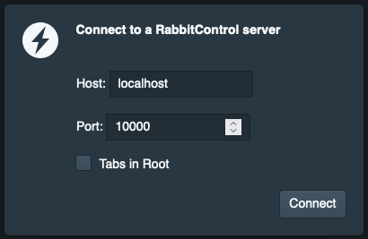

# rcp-ts-client
A [RabbitControl](http://rabbitcontrol.cc) Client written in Typescript using React and Blueprint

## client.rabbitcontrol.cc

Please fine the official client hosted here:  
[http://client.rabbitcontrol.cc](http://client.rabbitcontrol.cc)

Enter Host and Port of your rcp server application and click “Connect”.

You can also connect to a rcp server directly by providing ip:port in the URL:  
[http://client.rabbitcontrol.cc/#192.168.0.23:10000](http://client.rabbitcontrol.cc/#192.168.0.23:10000)

After connecting to a RabbitControl server you should see all exposed parameters.

### Parameter

The follogin get-parameter are available

- d=1: debug output
- t=1: tabs in root

## client.zip

A bundled version of the client can be found here:

[http://client.rabbitcontrol.cc/client.zip](http://client.rabbitcontrol.cc/client.zip)